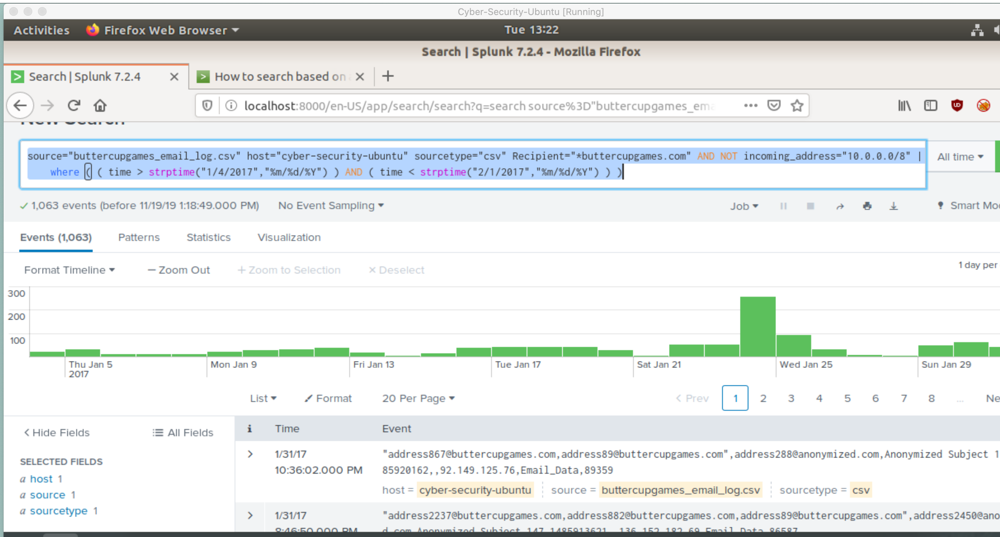
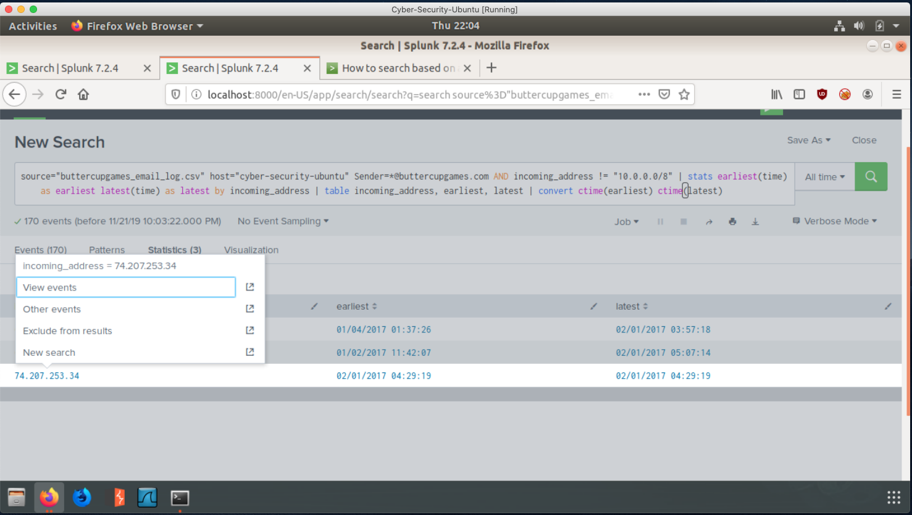
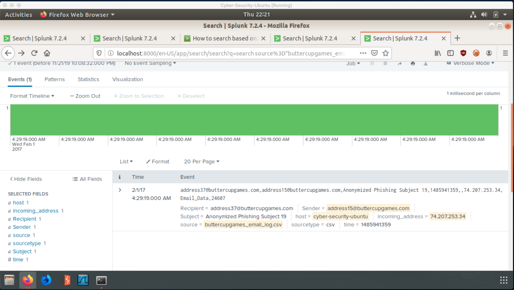

# SIEMs Homework Challenge

## Background

You are investigating **phishing attacks** at buttercupgames.  Phishers often try to send emails where the **from address** uses a company's domain name.

### Facts

The buttercupgames domain name is **buttercupgames.com** (e.g., t1578@buttercupgames.com) and the incoming IP address is **10.0.0.0/8**.
`source="buttercupgames_email_log.csv" host="cyber-security-ubuntu" sourcetype="csv" Recipient="*buttercupgames.com" AND incoming_address="10.0.0.0/8"`


### Your Goal ß

Find possible **anomalies** that may indicate a phishing attack.

### Search Criteria

1. Your search will look for *Senders* that have an email address in the buttercupgames domain but are NOT using the 10.0.0.0/8 incoming IP address (Result 1).
`source="buttercupgames_email_log.csv" host="cyber-security-ubuntu" sourcetype="csv" Recipient="*buttercupgames.com" AND NOT incoming_address="10.0.0.0/8"`


2. The inputs from Result 1 are used in the search to look at the dates for the earliest and latest emails.  If the earliest we have seen an incoming IP address was *within the last day* of our search period (1/4/2017 - 2/1/2017), it means this is the first time we've seen the IP address, and it may qualify as anomalous (Result 2).

`source="buttercupgames_email_log.csv" host="cyber-security-ubuntu" sourcetype="csv" Recipient="*buttercupgames.com" AND NOT incoming_address="10.0.0.0/8" | where ( ( time > strptime("1/4/2017","%m/%d/%Y") ) AND ( time < strptime("2/1/2017","%m/%d/%Y") ) )`



3.The inputs from Result 2 are used in the search to create a *table* with the incoming IP addresses, the earliest date/time and the latest date/time.

`source="buttercupgames_email_log.csv" host="cyber-security-ubuntu" Sender=*@buttercupgames.com AND incoming_address != "10.0.0.0/8" | stats earliest(time) as earliest latest(time) as latest by incoming_address | table incoming_address, earliest, latest | convert ctime(earliest) ctime(latest)`



### Things to Capture About the Incident

* What is the **incoming IP address**?

* Who is the **Sender**?

* Who is the **Recipient**?

* What is the **Subject** of the email?

* What is the **time** of the event?

* Are there any **attachments**?  

`source="buttercupgames_email_log.csv" host="cyber-security-ubuntu" Sender=*@buttercupgames.com AND incoming_address != "10.0.0.0/8"  incoming_address="74.207.253.34"`



`_** there is no attachment to the email in the above incidence **_`

### New Commands

This is a challenging exercise, but we'll give you some help along the way.  The exercise use commands from the class lessons such as `relational operators`, `pipes`, `wildcards`, `tables`, `reports`,  and `alerts`.

The exercise will require that you also learn some **new** Splunk functions. You will use the Splunk reference material to learn the new commands.  RTM is a necessary skill for a security professional as threats are continually appearing.

#### Gathering Statistics with Splunk

* We want to gather statistics on the incoming IP addresses. The **stats** function calculates summary statistics based on fields in your events and is used to present that data in a tabular format.

* Splunk Reference: https://docs.splunk.com/Documentation/Splunk/7.2.4/SearchReference/Statshttps://docs.splunk.com/Documentation/Splunk/7.2.5/Search/Usethestatscommandandfunctions

* Example: We want to display the number (count) of `400` or `500` type return codes from a web server.  The codes are stored in the `status` field.

##### ```bash

  sourcetype=access_* (status=4* OR status=5*) | stats count by status

##### `source="access_30DAY.log" host="cyber-security-ubuntu" sourcetype="access_combined_wcookie" status="4*" OR status="5*"`


#### Time Functions - They Work with the 'stats' function.

* We also need to gather the *earliest* and *latest* times from the raw data so we will use the **earliest** and **latest** time functions.

* Splunk Reference: https://docs.splunk.com/Documentation/Splunk/7.2.4/SearchReference/Timefunctions

* Examples:

 ```bash
  earliest(time) as earliest
    ```

 ```bash
  latest(time) as latest
    ```

#### Conversion Functions

* We will output the `earliest` and `latest` *date* and *time* in a human-readable format.  The **convert** command converts field values in your search results into numerical values.

* We will use **ctime** with the **convert** function to convert an *epoch* time to an *ascii human-readable* time. It is similar to `ctime` in a shell or programming language.

* Splunk Reference: https://docs.splunk.com/Documentation/Splunk/7.2.4/SearchReference/Convert

* Epoch Time: https://www.computerhope.com/jargon/e/epoch.htm

* Examples:

 ```bash
  convert ctime(earliest)

 ```bash
  convert ctime(latest)


## Let's Start

Write down **each part** of the search and then try it in Splunk.

1. Upload **buttergames_email_log.csv** into Splunk.

2. Locate the fields of interest in **Interesting Fields** and place them in **Selected Fields**. For example **incoming_address, time**.

## Create the Search

The search has three parts:

**Part 1:**

* First, create a search where the Sender is *anyone* from @buttercupgames.com but the incoming IP address is NOT in the domain.

 * Hint: This section uses a `wildcard` and `relational operator`.

 * Try it in Splunk.

 `source="buttercupgames_email_log.csv" host="cyber-security-ubuntu" Sender="*@buttercupgames.com" AND incoming_address!="10.*"`


**Part 2:**

* Now locate emails that satisfy the criteria for suspicious emails. Here we will use the **stats** command with the *earliest* and *latest* times *by* incoming IP address.

	* Hint: This uses a `pipe` command.

	* Try it in Splunk.
	
	* How is the time displayed?
	
	* Check the earliest time value = `1483511846` at https://www.epochconverter.com/
	 
	
	`source="buttercupgames_email_log.csv" host="cyber-security-ubuntu" Sender="*@buttercupgames.com" AND incoming_address!="10.*"| stats earliest(time) AS mtime by incoming_address | convert ctime(mtime)`
	


**Part 3:** 

* We are now in the last part of the search.  Place the output of the **stats** command in a **table** showing the `incoming IP address`, and the `earliest date/time` and `latest date/time` in human-readable form.

	* Hint: *convert* the earliest and latest time using the *ctime* command.

	* Try it in Splunk.
	
	* How is the time displayed?

		
Now look at the results and collect information for the incident report.
	
* What **incoming IP address** was used in the attack? 
	

* Click the suspect `incoming IP address` in the Statistics Table and select **View Event** until the event is displayed.


*  Who was the **Sender** in the Phishing attack?

	
*  Who was the **Recipient** of the attack?

	
*  What was the **Subject** of the email?

	
*  What is the **Time** of the event?

	
*  Where there any **Attachments**?
`source="buttercupgames_email_log.csv" host="cyber-security-ubuntu" Sender=*@buttercupgames.com AND incoming_address != "10.0.0.0/8"  incoming_address="74.207.253.34"`


`_** there is no attachment to the email in the above incidence **_`
	
## Create a Cron Alert

We can monitor for `phishing attacks` with Splunk by scheduling alerts as a `cron` job.  

Please create a `scheduled cron alert` for the phishing search **which runs every five minutes**.

Review **Linux Day 2** on the `cron command` if you need a refresher on cron syntax. 

* First, run the `phishing` search and select Save as `Alert`.

Configure the alert as follows:

* Title: `Phishing Alert`

* Description: `This alert runs as a cron job every five minutes.`

* Permission: `Shared App`

* Alert Type: `Scheduled`, `Run on Cron Schedule`

* Time Range: `All Time`

* Cron Expression:  *Here enter the cron command to run every 5 minutes*.

* Trigger Conditions: Keep defaults

* Trigger Actions: 

	* Add Actions `Add to Triggered Alert`

	* Severity = `Critical`

* `Save` the Aler

### View the Alert


* View the Alert from the **App** bar

### Trigger the Alert

* Run the search - select `All Time`

* Check the `Activity -> Triggered Alert` list.


### Disable the Alert

* Disable the Alert after 10 entries.


`Congratulations ....Homework Complete!`
